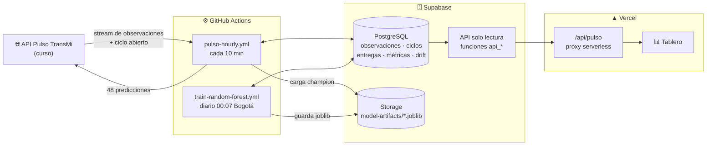
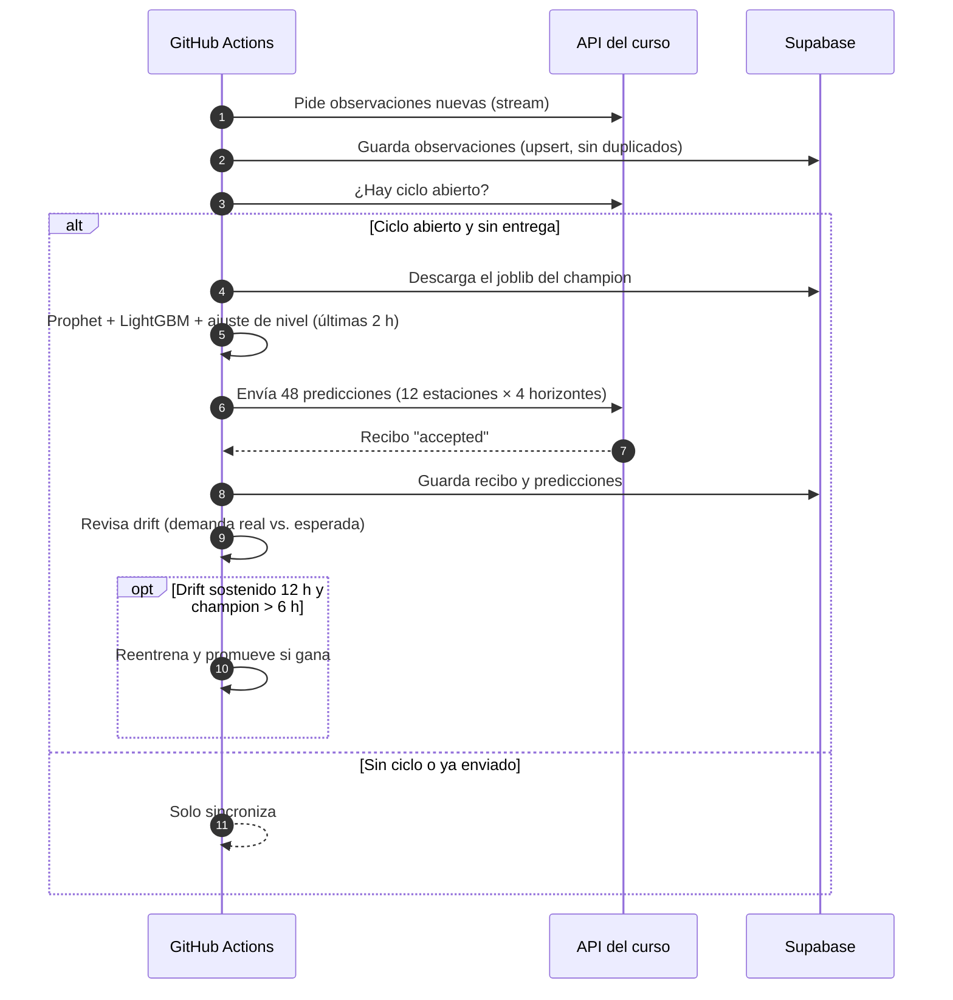
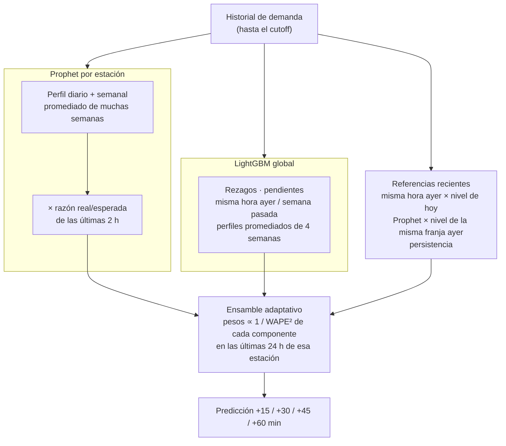
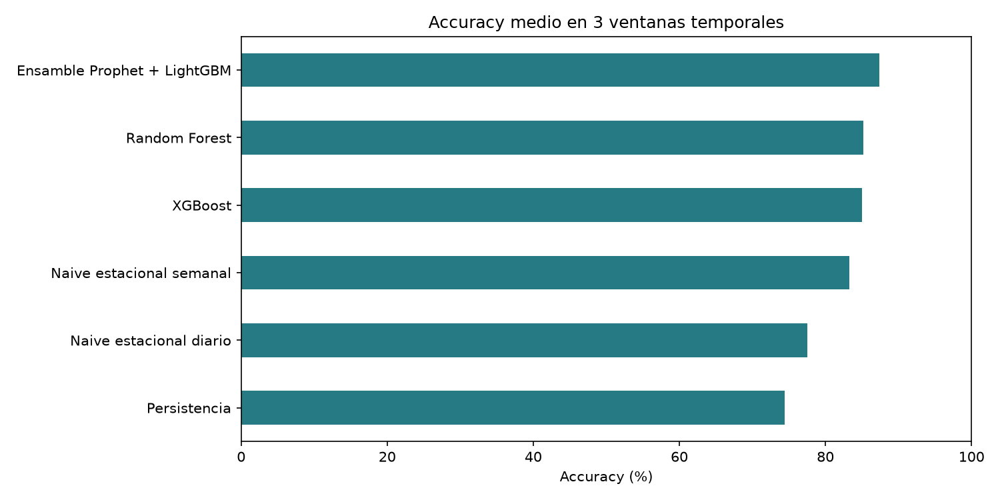
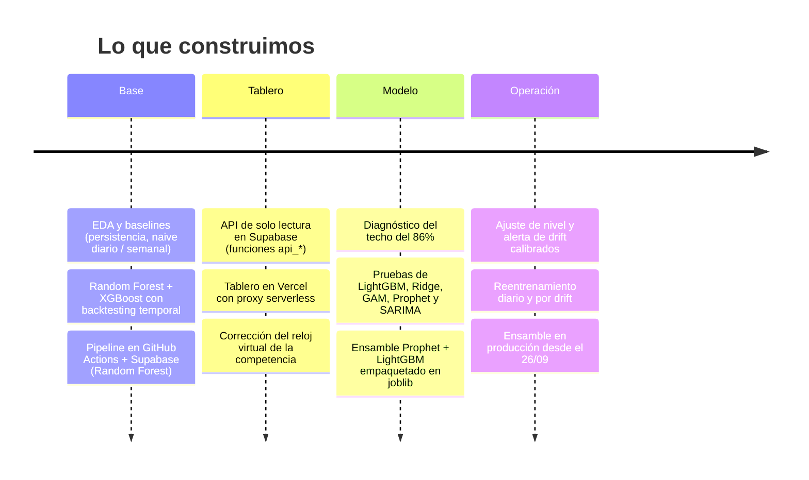

# 🚇 Pulso TransMi — Pronóstico de demanda por estación

Solución MLOps para el reto **Pulso TransMi**: pronosticar la demanda de 12 estaciones de TransMilenio cada 15 minutos (horizontes de +15, +30, +45 y +60 min), enviar las predicciones automáticamente en cada ciclo y monitorear el desempeño.

| | |
|---|---|
| 🤖 **Modelo en producción** | Ensamble **adaptativo**: Prophet + LightGBM + referencias recientes, con pesos que se recalculan cada ciclo según el error de las últimas 24 h |
| 📈 **Validación con datos reales de la competencia** | **85,8%** ensamble · 83,8% Random Forest · 80,7% naive semanal |
| 🔁 **Automatización** | Envíos cada ciclo · reentrenamiento diario · evaluación por drift de datos o de desempeño · promoción solo si supera a lo que producción envió |
| 📋 **Fase de drift** | [Monitoreo, disparadores y evidencia](reports/monitoreo_drift.md) |
| 📊 **Tablero** | Vercel + API de solo lectura en Supabase |

> 💡 Los diagramas usan [Mermaid](https://mermaid.js.org/). GitHub los dibuja automáticamente. En **Visual Studio Code**, instala la extensión *Markdown Preview Mermaid Support* y abre la vista previa con `Ctrl+Shift+V`.

---

## 🗺️ Arquitectura



---

## ⏱️ Qué pasa cada hora



---

## 🧠 El modelo



**Por qué funciona**
- **El perfil promediado quita ruido.** Un solo valor de "la semana pasada" es ruidoso; Prophet promedia muchas semanas y obtiene la forma típica del día.
- **LightGBM reacciona a lo reciente** y los dos se equivocan de forma distinta, así que al combinarlos los errores se compensan.
- **El ajuste de nivel responde al drift.** Si en las últimas 2 horas llega un 20% más de gente de lo esperado, la parte de Prophet sube un 20%. Con 2 horas se filtra el ruido y el cambio igual se detecta en 2–3 actualizaciones.
- **Pesos adaptativos para la fase de drift.** En cada ciclo y estación se mide cuánto se equivocó cada componente en las últimas 24 h, usando solo targets ya observados, y se le da más peso al que acertó mejor. Si los picos cambian de hora, Prophet pierde peso solo. Sin drift cuesta ~0,5 pp; con drift simulado gana de 2 a 11 pp ([detalles](reports/monitoreo_drift.md)).
- **Picos que cambian de altura.** Un quinto componente corrige la curva de Prophet con el nivel observado en la misma franja de ayer. Así, si un pico creció o se aplanó (como en Portal Américas y Banderas), se corrige desde su primer intervalo y no dos horas después. Suma de +0,1 a +1,1 pp según el escenario.
- **Todo va en un solo `.joblib`**: 12 modelos Prophet (en JSON), LightGBM, configuración de pesos, variables y métricas de validación. Cada versión registra el SHA-256 de su joblib.

---

## 📊 Resultados

### Backtest con datos de arranque (3 semanas)

| Modelo | Accuracy media | Peor semana | Desv. estándar |
|---|---:|---:|---:|
| **Ensamble adaptativo (producción)** | **87,41%** | 87,15% | 0,27 pp |
| Ensamble fijo 65/35 (versión anterior) | 87,88% | 87,58% | 0,28 pp |
| Random Forest (modelo anterior) | 85,16% | 84,93% | 0,38 pp |
| XGBoost | 84,99% | 84,60% | 0,39 pp |
| Naive semanal | 83,25% | 83,03% | 0,31 pp |
| Naive diario | 77,50% | 76,83% | 0,59 pp |
| Persistencia | 74,43% | 74,26% | 0,16 pp |



### Validación con datos reales de la competencia (últimos 7 días)

| Entrenamiento | Ensamble | Random Forest | Naive semanal |
|---|---:|---:|---:|
| 26/09 — primer champion del ensamble | **85,84%** | 83,84% | 80,72% |
| 27/09 — reentrenamiento automático por drift | **85,61%** | 83,43% | 80,21% |

### Robustez ante drift (simulación de +20% de demanda repentina)

| Modelo | Sin drift | Con drift |
|---|---:|---:|
| Ensamble sin ajuste de nivel | 87,87% | 81,40% ❌ |
| **Ensamble con ajuste de nivel (producción)** | **88,18%** | **87,90%** ✅ |

### Modelos que se probaron y se descartaron

| Idea | Resultado | Decisión |
|---|---|---|
| Ridge / GAM | ~85,2% | Relación casi lineal, pero sin ganancia |
| SARIMA (diferencia semanal) | 83,5% | Hereda el ruido de una sola semana |
| Predecir el residuo sobre el naive | 86,0% | Peor que predecir directo |
| Un modelo por horizonte | 85,9% | Peor que un modelo global |
| Stacking (Prophet como variable de LightGBM) | 87,5% | Peor que el promedio ponderado |
| Ajuste de nivel con 15 min | 86,3% | Reacciona al ruido |

---

## 🧭 Cronología del proyecto



---

## 🛡️ Monitoreo de drift

Después de cada entrega se compara la demanda real con la esperada por estación:

| Razón real / esperada | Qué significa | Qué hace el sistema |
|---|---|---|
| 0,85 – 1,15 | Normal | Nada |
| Fuera del rango por poco tiempo | Evento puntual | El ajuste de nivel lo corrige |
| Fuera del rango **12 h seguidas** (3 ventanas de 4 h) | Drift real | Registra `data_drift` y evalúa un candidato |
| Últimos 6 ciclos evaluados < 6 anteriores − 3 pp, o < naive semanal | Drift de desempeño | Registra `performance_drift` y evalúa un candidato |

Un candidato solo reemplaza al champion si supera al naive semanal y al Random Forest en el holdout de 7 días **y** a lo que producción realmente envió en las últimas 24 h (entrenado sin esas 24 h). Entre evaluaciones hay al menos 6 h. Todo queda registrado en `training_runs` y `monitoring_events`. Ver [monitoreo y reentrenamiento](reports/monitoreo_drift.md).

Con los datos de arranque, la regla da **~0,6% de falsas alarmas** por estación-hora y detecta **~79%** de los cambios de +20%. En la competencia ya detectó drift real en la estación **05100** (demanda a ~50% de lo normal) y en la **06000** (+20–30%).

---

## 📁 Estructura del repositorio

```
Primer_proyecto/
├── analysis/
│   ├── ensemble_model.py        # 🧠 Modelo de producción (PulsoEnsemble)
│   ├── pulso_pipeline.py        # ⚙️ sync / train / forecast + drift
│   ├── backtest_models.py       # 📏 Backtest de 3 semanas (incluye el ensamble)
│   ├── forecasting_core.py      # Variables y métrica oficial compartidas
│   ├── compare_baselines.py     # Comparación de un solo corte
│   ├── eda_starter.py           # Análisis exploratorio
│   └── load_starter_to_supabase.py
├── dashboard/                   # ▲ Tablero para Vercel
│   ├── api/pulso.js             #   Proxy a las funciones api_* de Supabase
│   └── public/index.html        #   Página con Chart.js
├── supabase/migrations/
│   ├── 202609220001_initial_schema.sql        # Tablas con RLS
│   ├── 202609250001_results_api.sql           # API de resultados de solo lectura
│   └── 202609260001_results_api_virtual_clock.sql  # Ventanas según el reloj virtual
├── .github/workflows/
│   ├── pulso-hourly.yml         # Cada 10 min: sincroniza, envía, monitorea
│   └── train-random-forest.yml  # Diario: entrena y promueve el champion
├── reports/                     # EDA, backtests, protocolo y guías
└── data/starter/                # Datos públicos de arranque del curso
```

---

## 🚀 Cómo operar

### Automático (no requiere nada)
- **Cada 10 minutos:** sincroniza, envía si hay ciclo abierto y revisa drift. Si la API o Supabase fallan por un problema de red momentáneo, reintenta solo hasta 3 veces dentro de la misma ejecución.
- **Cada día a las 00:07 (Bogotá):** reentrena y promueve el champion solo si le gana al naive semanal y al Random Forest.

### Manual
| Quiero… | Cómo |
|---|---|
| Entrenar ya | GitHub → **Actions → Train and promote forecast model → Run workflow** |
| Ver resultados | Tablero de Vercel (accuracy, champion, entregas, predicción vs. real) |
| Revisar una ejecución | GitHub → **Actions** → abrir la ejecución → log del paso *Sync stream…* |
| Correr el backtest local | `pip install -r requirements-modeling.txt` y `python analysis/backtest_models.py --source local` |

### Volver al modelo anterior
- **Sin tocar código:** en el SQL Editor de Supabase, marca como `champion` la versión `rf-…` en `model_versions` (el pipeline sigue sabiendo usar joblibs de Random Forest). El entrenamiento diario puede volver a promover el ensamble si gana.
- **Definitivo:** revertir el PR #2 en GitHub.

---

## 🔐 Configuración y secretos

| Dónde | Variable | Uso |
|---|---|---|
| GitHub Actions Secrets | `PULSO_API_KEY` | Llave de la API del curso |
| GitHub Actions Secrets | `SUPABASE_URL`, `SUPABASE_SECRET_KEY` | Escritura en Supabase (solo backend) |
| Vercel | `SUPABASE_URL`, `SUPABASE_PUBLISHABLE_KEY` | Lectura de la API `api_*` (clave pública) |
| Local | `.env.local` | Copia de `.env.example`; **nunca** se sube al repositorio |

- Las tablas de Supabase tienen RLS activo y no son accesibles para `anon`. El tablero solo usa las funciones `api_*`, que devuelven resultados agregados.
- Se necesita un bucket privado de Supabase Storage llamado `model-artifacts`.

Guías detalladas:
- [Operación de envíos](reports/operacion_envios_v1.md)
- [Montaje de Supabase](reports/supabase_setup.md)
- [Despliegue en Vercel](reports/despliegue_vercel.md)
- [Protocolo de validación](reports/protocolo_validacion_v1.md)
- [Backtest de modelos](reports/backtest_modelos_v1.md)

---

## ⚠️ Limitaciones conocidas

- Ante caídas muy fuertes de demanda (por ejemplo, 05100 a ~50%), el ensamble resiste mucho mejor que el naive, pero pierde precisión: en simulación, ~60% de accuracy en esa estación.
- La accuracy **acumulada** del ranking promedia todos los ciclos desde el 25/09, incluidos los del Random Forest; la mejora del ensamble se ve antes en la vista de **últimos ciclos**.
- Los backtests usan los datos sintéticos de arranque; la referencia final es el desempeño en los ciclos oficiales.
