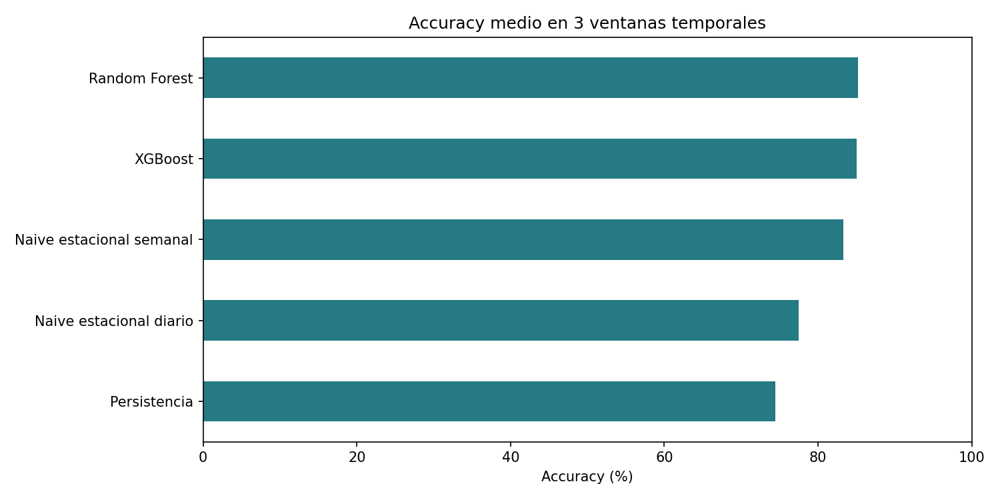

# Backtesting temporal de modelos — Pulso TransMi v1

## Protocolo

- Origen de los datos: `supabase`.
- 3 ventanas semanales consecutivas. Cada fold entrena solo con targets anteriores a su corte y valida en la semana siguiente.
- Las features usan estación, horizonte, calendario, rezagos y promedios calculados hasta el origen. No se incluyen variables futuras de contexto.
- Accuracy usa la métrica oficial: WAPE calculado por estación y luego promediado sin ponderar.
- Todos los resultados usan el starter sintético; no son puntajes oficiales de competencia.

| Fold | Inicio validación (Bogotá) | Fin validación (Bogotá)   | Filas train | Filas validación |
| ---- | -------------------------- | ------------------------- | ----------- | ---------------- |
| 1    | 2026-08-19 00:00:00-05:00  | 2026-08-25 23:45:00-05:00 | 19,572      | 8,052            |
| 2    | 2026-08-26 00:00:00-05:00  | 2026-09-01 23:45:00-05:00 | 27,636      | 8,052            |
| 3    | 2026-09-02 00:00:00-05:00  | 2026-09-08 23:45:00-05:00 | 35,700      | 8,052            |

## Estabilidad agregada

La desviación estándar y el mínimo entre folds ayudan a ver si un modelo depende demasiado de una sola semana. Menor desviación y mayor peor-fold suelen ser señales de mayor estabilidad; se deben considerar junto con la media.

| model                    | Accuracy media (%) | Desv. estándar (pp) | Peor fold (%) | Mejor fold (%) | WAPE medio | MAE medio |
| ------------------------ | ------------------ | ------------------- | ------------- | -------------- | ---------- | --------- |
| Random Forest            | 85.206             | 0.377               | 84.969        | 85.641         | 0.148      | 51.759    |
| XGBoost                  | 85.007             | 0.372               | 84.658        | 85.398         | 0.15       | 51.947    |
| Naive estacional semanal | 83.249             | 0.313               | 83.026        | 83.606         | 0.168      | 59.387    |
| Naive estacional diario  | 77.503             | 0.587               | 76.826        | 77.886         | 0.225      | 76.382    |
| Persistencia             | 74.434             | 0.162               | 74.255        | 74.572         | 0.256      | 90.737    |

## Accuracy por ventana

| Modelo                   | Fold 1 (%) | Fold 2 (%) | Fold 3 (%) |
| ------------------------ | ---------- | ---------- | ---------- |
| Naive estacional diario  | 77.8       | 76.83      | 77.89      |
| Naive estacional semanal | 83.61      | 83.03      | 83.11      |
| Persistencia             | 74.26      | 74.47      | 74.57      |
| Random Forest            | 84.97      | 85.01      | 85.64      |
| XGBoost                  | 84.96      | 84.66      | 85.4       |

## Métodos comparados

- **Persistencia:** predice que la demanda seguirá igual que en el último intervalo conocido (15 minutos antes del origen).
- **Naive estacional diario:** repite el valor de la misma estación y franja horaria del día anterior.
- **Naive estacional semanal:** repite el valor de la misma estación, hora y día de la semana anterior.
- **Random Forest:** combina rezagos, medias móviles, calendario, estación y horizonte con muchos árboles entrenados sobre muestras/features aleatorias.
- **XGBoost:** combina árboles construidos secuencialmente; cada árbol intenta corregir errores de los anteriores.

Los tres primeros son baselines interpretables. Indican qué tan difícil es la serie y evitan atribuir valor a un modelo complejo que no supere reglas sencillas.
