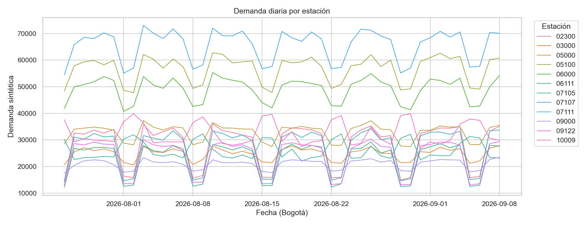
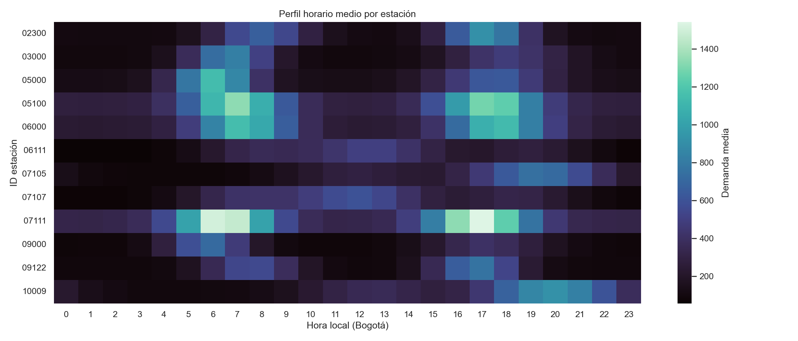

# Análisis exploratorio — Pulso TransMi starter v1

## Alcance

El starter contiene demanda **sintética** y contexto generado para el reto. Los nombres, corredores y coordenadas de estaciones corresponden a metadatos; la demanda no representa afluencia histórica real. La zona horaria analítica es `America/Bogota`.

- Filas de demanda: 51,840; filas de contexto: 4,320; estaciones: 12.
- Cobertura: 2026-07-26 00:00:00-05:00 a 2026-09-08 23:45:00-05:00, en intervalos de 15 minutos.
- Filas por estación: mínimo 4,320, máximo 4,320; intervalos esperados por estación: 4,320.
- Claves estación-tiempo duplicadas: 0; valores ausentes en observaciones: 0; valores negativos: 0.
- Intervalos faltantes por estación: 0 en total.
- Verificación SHA-256 del manifiesto: correcta.

## Distribución de demanda

| Estadístico | Valor |
|---|---:|
| Media | 356.52 |
| Desviación estándar | 319.47 |
| Mínimo / mediana / máximo | 14 / 263 / 2284 |
| Percentil 90 / 95 / 99 | 799 / 1057 / 1481 |
| Filas con demanda cero | 0 (0.00%) |

### Resumen por estación

|                                                | count  | mean   | std    | min   | median | max    |
| ---------------------------------------------- | ------ | ------ | ------ | ----- | ------ | ------ |
| 02300 — Calle 100 - Marketmedios               | 4320.0 | 293.97 | 279.29 | 29.0  | 158.0  | 1472.0 |
| 03000 — Portal Suba                            | 4320.0 | 258.43 | 216.83 | 48.0  | 153.0  | 1252.0 |
| 05000 — Portal Américas                        | 4320.0 | 342.06 | 288.81 | 59.0  | 201.0  | 1944.0 |
| 05100 — Banderas                               | 4320.0 | 591.06 | 391.06 | 159.0 | 392.0  | 2065.0 |
| 06000 — Portal El Dorado – C.C. NUESTRO BOGOTÁ | 4320.0 | 510.94 | 343.01 | 127.0 | 340.5  | 1789.0 |
| 06111 — Universidades – CityU                  | 4320.0 | 238.89 | 169.95 | 14.0  | 207.0  | 835.0  |
| 07105 — Movistar Arena                         | 4320.0 | 272.59 | 217.44 | 42.0  | 213.5  | 1313.0 |
| 07107 — Universidad Nacional                   | 4320.0 | 281.03 | 198.73 | 17.0  | 248.0  | 982.0  |
| 07111 — Ricaurte - NQS                         | 4320.0 | 683.72 | 459.36 | 159.0 | 452.0  | 2284.0 |
| 09000 — Portal Usme                            | 4320.0 | 217.87 | 183.96 | 33.0  | 128.0  | 1071.0 |
| 09122 — Calle 72                               | 4320.0 | 249.8  | 234.41 | 22.0  | 134.0  | 1249.0 |
| 10009 — Museo Nacional                         | 4320.0 | 337.92 | 270.66 | 50.0  | 266.0  | 1434.0 |

## Patrones temporales iniciales

La media agregada por hora alcanza su máximo a las **17:00** (701.1) y su mínimo a las **02:00** (137.8). La mayor media por día de semana es **Tuesday** (382.8); la menor es **Saturday** (296.1). Estas cifras agregan estaciones con escalas distintas, por lo que se debe revisar también el perfil por estación.

| Dia       | Demanda media |
| --------- | ------------- |
| Monday    | 381.82        |
| Tuesday   | 382.76        |
| Wednesday | 381.9         |
| Thursday  | 380.4         |
| Friday    | 374.88        |
| Saturday  | 296.05        |
| Sunday    | 298.87        |

## Contexto

El contexto se une por timestamp, con validación muchos-a-uno. Correlaciones lineales descriptivas con demanda:

|                      | correlation |
| -------------------- | ----------- |
| rain_mm              | -0.01       |
| rain_forecast        | -0.008      |
| temperature_c        | 0.208       |
| temperature_forecast | 0.205       |
| event_intensity      | 0.088       |

Estas correlaciones no establecen causalidad. Además, para pronosticar cada target solo se pueden usar variables de contexto conocidas en el momento de emitir la predicción; las columnas observadas futuras provocarían fuga de información.

## Decisiones para la siguiente fase

1. Mantener `station_id` como texto para preservar identificadores como `02300`.
2. Usar validación temporal: entrenar en los primeros 38 días y evaluar los últimos 7 días, replicando los cuatro horizontes de 15 a 60 minutos.
3. Comparar persistencia y naïve estacional (96 intervalos diarios; 672 semanales) antes del Random Forest global sugerido como ejemplo por el curso.
4. Reportar métricas por estación y horizonte junto con la métrica oficial promedio por estación.
5. No usar una partición aleatoria ni rellenar rezagos con valores futuros.

## Integridad

| Archivo | SHA-256 local | Coincide con metadata |
|---|---|---|
| `stations.csv` | `d4dea46ceee2fb3ebe76362fbaa925c95b586130270c0998438f42494a7471ef` | sí |
| `observations.csv` | `ecc6a32174f84e810c4b684db52f5e4eebd815f11f5e5b22d3574116b837eacd` | sí |
| `context.csv` | `891f422628cc5033eaf89a1e8f7e69edab65afba1495a8072d2b395965d7656d` | sí |
