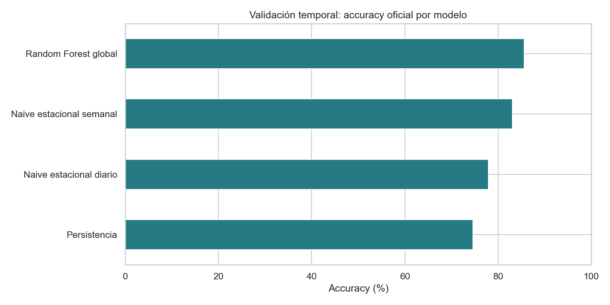

# Comparación inicial de modelos — Pulso TransMi

## Diseño de evaluación

- Entrenamiento: orígenes horarios anteriores al corte temporal; solo se conservan ejemplos cuyos targets también preceden al corte.
- Validación: últimos siete días completos disponibles en el starter, con orígenes horarios y horizontes de +15, +30, +45 y +60 minutos.
- Ejemplos de entrenamiento: 35,700; ejemplos de validación: 8,052.
- Corte temporal: `2026-09-02 00:00:00-05:00`; fin del histórico: `2026-09-08 23:45:00-05:00`.
- Random Forest global: una sola estimación conjunta con identificador de estación, horizonte, calendario, rezagos hasta el origen y medias móviles pasadas.
- No se usó contexto meteorológico porque en el corte está marcado como observado y no se estableció que sus valores futuros estuvieran disponibles al emitir el pronóstico.

## Resultados agregados

La accuracy oficial se calcula con WAPE por estación y luego se promedia sin ponderar entre estaciones. Un mayor accuracy y menor MAE/WAPE indican mejor resultado.

| Modelo                   | Accuracy oficial (%) | WAPE medio por estación | MAE    |
| ------------------------ | -------------------- | ----------------------- | ------ |
| Random Forest global     | 85.641               | 0.144                   | 50.93  |
| Naive estacional semanal | 83.113               | 0.169                   | 60.821 |
| Naive estacional diario  | 77.886               | 0.221                   | 76.323 |
| Persistencia             | 74.572               | 0.254                   | 91.711 |

## Accuracy por horizonte

| Horizonte | Persistencia | Naive estacional diario | Naive estacional semanal | Random Forest global |
| --------- | ------------ | ----------------------- | ------------------------ | -------------------- |
| +15 min   | 83.05        | 79.2                    | 83.25                    | 87.11                |
| +30 min   | 78.16        | 78.43                   | 82.94                    | 86.84                |
| +45 min   | 72.15        | 79.46                   | 83.3                     | 85.42                |
| +60 min   | 65.68        | 78.87                   | 83.54                    | 84.56                |

## Lectura

Estos resultados son una primera referencia local sobre datos sintéticos. El vencedor de este corte no debe declararse champion todavía: conviene repetir backtesting en varios cortes temporales, revisar variación por estación y horizonte, y contrastar contra los ciclos oficiales revelados por la API.

El baseline diario usa el valor de la misma hora del día anterior; el semanal usa el valor de la misma hora y día de la semana anterior. Ambos solo consultan observaciones disponibles a la hora de origen del pronóstico.
