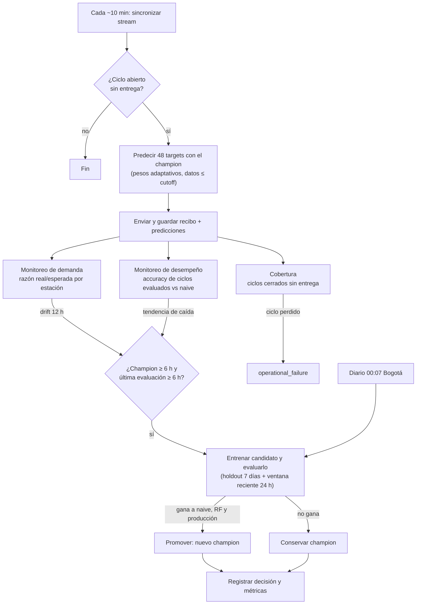

# Monitoreo, reentrenamiento y selección de versiones — fase de drift

Este documento responde a la [guía de la fase de adaptación](https://github.com/uexternadojz/pulso-transmi/blob/main/docs/fase-drift.md): cómo se verifica la operación, cómo se distingue un problema operativo de un cambio en la demanda, qué dispara una evaluación, cómo se comparan versiones sin información futura y qué evidencia respalda cada decisión.



---

## 1. Continuidad de la ingesta y de las submissions

| Qué se verifica | Cómo | Dónde queda |
|---|---|---|
| El stream avanza | El cursor se confirma **solo después** de guardar cada página (upsert por `station_id, observed_at`) | `collector_state`, `collector_runs` (filas recibidas, estado, error) |
| Cada ciclo recibe entrega | Tras cada envío se buscan ciclos vistos que cerraron sin submission oficial | Evento `operational_failure` en `monitoring_events` |
| Fallas de red momentáneas | Timeouts, cortes de conexión y HTTP 5xx terminan con código 75 y se **reintentan hasta 3 veces** en la misma ejecución; los reintentos son idempotentes (`Idempotency-Key` por ciclo y modelo) | Log de GitHub Actions |
| Fallas persistentes | La ejecución queda en rojo y GitHub envía correo; la siguiente ejecución, ~10 min después, vuelve a intentar | GitHub Actions |
| Una entrega aceptada puede seguir pendiente | La accuracy solo se calcula para ciclos con los 48 targets revelados; los demás se reportan como pendientes | Tablero: tabla "Accuracy por ciclo" |

## 2. Problema operativo vs. cambio en la demanda

| Señal | Interpretación |
|---|---|
| Ciclo sin entrega, ejecución fallida, stream sin filas nuevas | **Operativo**: no se predijo, o se predijo con datos viejos |
| Accuracy baja **y** naive semanal bajo en los mismos targets | **Cambio en la demanda**: esas horas son difíciles para cualquier modelo que mire la semana pasada |
| Accuracy baja **y** naive semanal normal | **Problema del modelo** |
| Razón demanda real / esperada fuera de 0,85–1,15 durante 12 h en una estación | **Cambio de nivel** en esa estación (drift de datos) |

La tabla "Accuracy por ciclo" del tablero (`api_cycle_accuracy`) muestra, para cada entrega, la accuracy del modelo y la del naive semanal **sobre exactamente los mismos targets**.

## 3. Qué dispara una evaluación o un entrenamiento, y con qué datos

| Disparador | Regla | Por qué |
|---|---|---|
| **Programado** | Todos los días a las 00:07 (Bogotá) | Incorporar el día completo más reciente |
| **Drift de datos** | Razón real/esperada fuera de 0,85–1,15, del mismo lado, en las 3 últimas ventanas de 4 h (12 h) | Con los datos de arranque: ~0,6% de falsas alarmas por estación-hora y ~79% de detección de un cambio de +20% |
| **Drift de desempeño** | Media de los últimos 6 ciclos evaluados < media de los 6 anteriores − 3 pp, **o** < naive semanal en los mismos targets | Tendencia, no un único resultado malo |

**Límites para evitar oscilaciones:** no se evalúa si el champion tiene menos de 6 h ni si la última evaluación fue hace menos de 6 h. Un disparador **evalúa** un candidato: reentrenar no implica promover.

**Datos:** todas las observaciones publicadas hasta el cutoff vigente. Prophet usa toda la historia de cada estación y LightGBM usa ejemplos horarios cuyos targets ya fueron observados. Ningún dato posterior al cutoff entra al entrenamiento.

## 4. Comparación temporal de versiones sin información futura

Un candidato solo se promueve si pasa **las dos** pruebas:

1. **Holdout de 7 días:** un ensamble entrenado con datos anteriores al holdout debe superar al naive semanal y a un Random Forest entrenado con los mismos datos.
2. **Ventana reciente (24 h, mínimo 6 ciclos evaluados):** un ensamble entrenado **solo con datos anteriores a la ventana** predice los mismos targets que producción ya envió, y debe superar la accuracy de **lo que producción realmente envió**. No se re-simula al champion: se usan sus recibos y predicciones guardados.

Si la ventana reciente tiene menos de 6 ciclos evaluados, se decide con el holdout de 7 días y queda registrado el motivo.

**Por qué no hay fuga:** cada variable de un target se calcula solo con observaciones hasta su origen (cutoff). Se verificó que una predicción es idéntica con la historia completa y con la historia truncada en el origen.

## 5. Evidencia para mantener, promover o retirar una versión

| Evidencia | Tabla / lugar |
|---|---|
| Cada entrenamiento (promovido o no): rango de datos, parámetros, métricas del holdout y de la ventana reciente, motivo | `training_runs` |
| Versiones, estado (`champion` / `retired`), fecha de promoción, ubicación y **SHA-256 del joblib** | `model_versions` y bucket `model-artifacts` |
| Disparadores y decisiones (`data_drift`, `performance_drift`, `operational_failure`, `retraining_decision`) con sus datos | `monitoring_events` |
| Recibos de cada entrega y predicciones enviadas | `submissions`, `predictions` |
| Código exacto de cada versión | `code_commit` en `training_runs` / `model_versions` |

Cambiar el nombre no demuestra reentrenamiento: cada versión nueva tiene su propio rango de datos, sus métricas y un joblib con SHA-256 distinto.

## 6. Qué ocurrió antes, durante y después del cambio

| Momento | Qué pasó | Evidencia |
|---|---|---|
| Hasta 26/09 | Random Forest en producción; en la competencia **81,84%** frente a 85,36% de su validación | Tablero, `model_versions` |
| 26/09 | Ensamble Prophet + LightGBM (65/35 fijo) promovido: validación con datos reales **85,84%** frente a 83,84% (RF) y 80,72% (naive) | `training_runs` |
| 26–27/09 | Drift detectado: estación **05100** con demanda ~50% de lo esperado y **06000** con +20–30% | `monitoring_events` (`data_drift`) |
| 27/09 02:51 | Reentrenamiento automático por drift: **85,61%** frente a 83,43% (RF) y 80,21% (naive) → promovido | `retraining_decision`, `training_runs` |
| Fase de drift (≥ 29/09) | El naive semanal cae a **57–62%**: la semana anterior dejó de parecerse a la actual. El ensamble fijo le gana por **15–29 pp**, pero se queda en **75–88%** por ciclo | Tabla "Accuracy por ciclo" |
| 30/09 | Diagnóstico: el ensamble fijo depende de la historia de semanas previas. Se agregan **pesos adaptativos** y la comparación contra lo que realmente envió producción | Este documento; simulaciones abajo |
| 30/09 (tarde) | Adaptativo promovido (87,06% frente a 78,52% de producción en las últimas 24 h). En sus primeros ciclos: **89–91,5%** frente a 77–86% del fijo | Tabla "Accuracy por ciclo" |
| 30/09 (noche) | En **05000 Portal Américas** los picos crecieron y en **05100 Banderas** se aplanaron, mientras el valle casi no cambió. El ajuste de nivel de las últimas 2 h corrige tarde el inicio de cada pico. Se agrega el componente **Prophet × nivel de la misma franja ayer** | "Predicción vs. demanda"; experimento abajo |

### Simulación de los tipos de drift de la guía

Datos de arranque con drift inyectado un día antes del corte, transición de 12 h, reentrenamiento diario y 3 días de evaluación. Los pesos adaptativos puntúan cada componente en las 24 h previas de esa estación y ponderan por 1/WAPE².

| Escenario | Naive semanal | Ensamble fijo 65/35 | **Ensamble adaptativo** | Diferencia |
|---|---:|---:|---:|---:|
| Sin drift | 83,0% | 88,2% | 87,7% | −0,4 |
| Cambio de nivel por estación | 62,3% | 83,7% | **85,8%** | +2,1 |
| Los picos se mueven 1 h | 65,8% | 75,6% | **84,1%** | +8,4 |
| Cambia la relación entre estaciones | 71,8% | 80,3% | **85,2%** | +4,8 |
| Mixto (los tres) | 52,4% | 71,2% | **82,4%** | +11,2 |

Peso medio que recibe cada componente según el escenario:

| Escenario | Prophet | LightGBM | Ayer ajustado a hoy | Persistencia |
|---|---:|---:|---:|---:|
| Sin drift | 0,35 | 0,38 | 0,18 | 0,09 |
| Picos se mueven | **0,14** | 0,42 | 0,27 | 0,17 |
| Mixto | **0,13** | 0,38 | 0,30 | 0,19 |

Cuando cambia la forma del día, Prophet pierde peso automáticamente, porque su perfil histórico deja de servir, y lo ganan las referencias recientes.

### Drift en la altura de los picos: componente "misma franja ayer"

En el tablero se vio que en Banderas y Portal Américas el modelo acierta en el valle y falla en los picos: en una estación se pasa y en la otra se queda corto. La razón de nivel usa las últimas 2 h, y al arrancar el pico esas 2 h fueron valle. Además, en Banderas el valle subió un poco, así que la razón llegaba al tope de 2× y duplicaba el pico: son los puntos en ~660 frente a ~250 reales.

El nuevo componente `prophet_slot` escala la curva de Prophet con la razón real/esperada **alrededor de la misma franja de ayer** (ventana de 2 h centrada en ella, que ya estaba observada en el origen). Si ayer el pico de la mañana fue la mitad de lo esperado, hoy el pico se corrige desde su primer intervalo. Entra como quinto componente del ensamble adaptativo, con peso ∝ 1/WAPE² igual que los demás.

Mismo protocolo que la tabla anterior (reentrenamiento diario, 3 días de evaluación). Accuracy oficial:

| Escenario | Naive semanal | Adaptativo (4 componentes) | **+ misma franja ayer** | Diferencia |
|---|---:|---:|---:|---:|
| Sin drift | 83,0% | 87,74% | **87,84%** | +0,10 |
| Cambio de nivel por estación | 62,3% | 85,75% | **86,27%** | +0,52 |
| Los picos cambian de altura (valle igual) | 64,8% | 85,81% | **86,20%** | +0,39 |
| Picos y valle en direcciones opuestas (tipo Banderas) | 66,3% | 85,62% | **86,04%** | +0,42 |
| Mixto (nivel + forma + relación) | 52,4% | 82,41% | **83,51%** | +1,10 |

Gana en los cinco escenarios, también sin drift, y más en horas pico (p. ej. mixto: 82,5% → 83,7%). También se probó y **se descartó**:

- **Pesos calculados sobre las mismas horas de ayer** en lugar de las últimas 24 h: ±0,1 pp, sin mejora.
- **Suavizar la razón de nivel cuando hay poco volumen** (sumar una constante al numerador y al denominador): no mejora y empeora en el escenario tipo Banderas (85,62% → 85,2–85,5%).
- **Ampliar el tope de la razón de 2× a 3×**: +0,01 a +0,26 pp. Es una ganancia marginal y aumenta el riesgo de sobrerreacción, así que se mantiene en 2×.

### Pesos que siguen más rápido cada fase

En la madrugada virtual del 18/09 el profesor inició la fase de drift. Aparecieron picos de ~1.000–1.200 pasajeros en plena madrugada (p. ej. 02300). La accuracy por ciclo cayó a 43–49% y el naive semanal a 25–39%. **Toda la clase** quedó entre 47% y 61% en los últimos 6 ciclos. Como las fases duran unas 6 h y los pesos adaptativos promediaban por igual los errores de 24 h, el ensamble tardaba en pasarle el peso a lo reciente.

Cambio: cada error de la ventana se pondera por exp(−(edad_h − 1)/3), así que la influencia de una hora cae a la mitad cada ~2 h (`adaptive_decay_h = 3`).

| Escenario | Adaptativo actual | + misma franja ayer | **+ errores recientes (τ = 3 h)** | Ventana de 6 h | Ventana de 12 h |
|---|---:|---:|---:|---:|---:|
| Sin drift | 87,74% | 87,84% | **87,81%** | 87,80% | 87,82% |
| Cambio de nivel | 85,75% | 86,27% | **86,49%** | 86,41% | 86,41% |
| Mixto | 82,41% | 83,51% | **84,16%** | 83,98% | 83,81% |
| Picos nuevos de madrugada, transición de 2 h | 85,34% | 85,52% | **85,55%** | 85,44% | 85,47% |

En el escenario de picos nuevos de madrugada, todas las variantes se quedan en ~71% en esas horas, igual que la persistencia. **Ningún modelo puede anticipar el primer ciclo de un cambio abrupto**, así que lo que se puede mejorar es la velocidad de recuperación. Ponderar por recencia es la variante más estable: en la simulación mixta gana de 0,3 a 1,1 pp por día y no empeora sin drift.

Los modelos guardados antes de este cambio siguen prediciendo con sus cuatro componentes (`adaptive_components` va dentro del joblib). El nuevo componente solo llega a producción cuando un candidato entrenado con él le gana al champion en las predicciones que realmente envió en las últimas 24 h.

También se probó entrenar solo con datos recientes (Prophet con 14 días, LightGBM con vida media de 3 días): empeoró en el escenario de nivel (80,4% frente a 83,7%) y se descartó.

**Prueba de punta a punta:** una simulación hora a hora con Supabase y API en memoria (drift mixto, champion viejo de pesos fijos) verificó el ciclo completo:
- el champion viejo sigue enviando;
- se detecta el drift y se evalúa un candidato;
- el candidato se promueve;
- la histéresis evita reevaluar cada hora;
- los últimos 6 ciclos suben de ~70% a ~77% frente a ~62–65% del naive.

También se verificó que un candidato que pierde contra lo que envió producción **no** se promueve.

---

## Dónde verlo en el tablero (Vercel)

| Sección | Qué muestra | Pregunta que responde |
|---|---|---|
| Evolución por ciclo | Accuracy del modelo y del naive semanal por ciclo, con líneas en cada cambio de tipo de modelo | ¿Cayó la demanda para todos (drift) o solo el modelo? ¿Qué pasó antes y después de un cambio de versión? |
| Accuracy por estación y ciclo | Mapa de calor de los últimos 24 ciclos evaluados | ¿El problema se concentra en una estación o es general? |
| Accuracy por ciclo | Tabla con la versión (adaptativo, fijo o RF), el cambio frente al ciclo anterior y la diferencia con el naive | ¿Es una tendencia o un único resultado malo? |
| Monitoreo: eventos y decisiones | Drift de datos por estación, drift de desempeño, ciclos sin entrega y decisiones de reentrenamiento, filtrables | ¿Qué detectó el sistema y qué decidió? |
| Entrenamientos y decisiones de promoción | Cada candidato con su holdout de 7 días y la comparación contra producción en las últimas 24 h | ¿Por qué se promovió o se conservó una versión? |

## Consultas de evidencia (SQL Editor de Supabase)

**Accuracy por ciclo frente al naive semanal**
```sql
select to_char(data_cutoff at time zone 'America/Bogota', 'DD/MM HH24:MI') as cutoff,
       model_version, round(accuracy::numeric, 1) as accuracy,
       round(naive_accuracy::numeric, 1) as naive_semanal, evaluated_targets || '/' || targets as evaluados
from public.api_cycle_accuracy(72);
```

**Decisiones y disparadores**
```sql
select detected_at at time zone 'America/Bogota' as cuando, event_type, station_id, model_version, decision, details
from public.monitoring_events
where event_type in ('retraining_decision', 'performance_drift', 'operational_failure')
order by detected_at desc limit 50;
```

**Entrenamientos (promovidos y no promovidos)**
```sql
select finished_at at time zone 'America/Bogota' as cuando, training_data_end, notes,
       metrics -> 'ensemble' ->> 'official_accuracy'       as holdout_ensamble,
       metrics -> 'weekly_naive' ->> 'official_accuracy'   as holdout_naive,
       metrics -> 'recent_window'                          as ventana_reciente
from public.training_runs order by finished_at desc limit 20;
```

**Historial de versiones**
```sql
select model_version, status, created_at, promoted_at, training_data_end, notes
from public.model_versions order by created_at desc;
```
